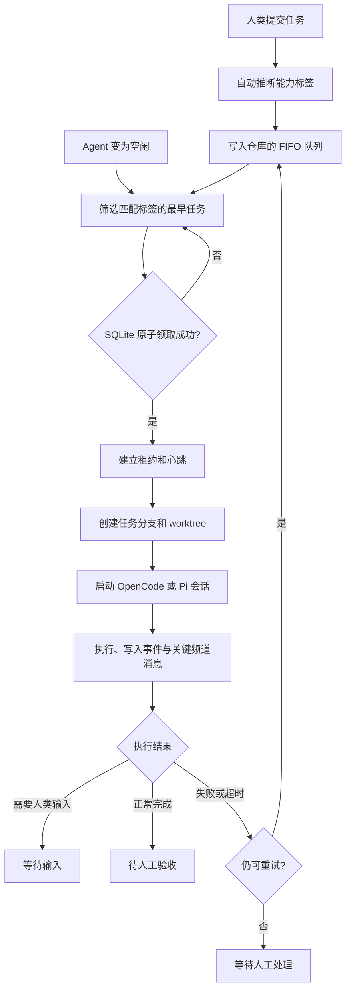

# 本机 Agent 工作空间设计

生成日期：2026-07-24
状态：已确认，等待实现计划
适用范围：单人、本机、多代码仓、OpenCode 与 Pi Agent

## 产品定义

这是一个以频道交流为主的本机 Agent 工作空间。人类、Agent 和任务都属于一个工作空间；代码仓是工作空间内的执行边界；频道承载日常协作；任务只在需要可执行、可追溯的工作时出现。

它借鉴 Raft 的“持久 Agent 身份 + 可替换 Runtime + 本机执行”边界，但不复刻其完整的服务器、多机与频道订阅系统。

## 目标与非目标

### 第一版目标

- 在一个工作空间中管理多个本地 Git 代码仓。
- 按代码仓组织频道，让人类与 Agent 通过消息协作。
- 用紧凑任务输入面板提交标题、详细描述和验收标准。
- 自动推断能力标签，并让匹配的空闲 Agent 以严格 FIFO 顺序独占领取任务。
- 后端托管 OpenCode 和 Pi Agent，为每项任务创建独立 Git worktree 与分支。
- 允许人类通过 `@Agent` 直接指定领取，或向忙碌 Agent 的当前任务会话追加输入。
- 在人工验收前保留完整日志、测试输出、diff 和提交；接受与合并分离。

### 第一版不做

- 频道的多 Agent 发布订阅、普通消息自动唤醒所有 Agent。
- Agent 私聊、搜索、附件、未读、表情与完整 Slack 功能。
- 多人账户、远程 Worker、云端协调、移动端和跨设备同步。
- 任务优先级、插队、自动扩缩、一个 Agent 多任务并发。
- 自动合并、自动推送或任何未经确认的仓外副作用。

## 核心对象

| 对象 | 职责 | 关键字段 |
| --- | --- | --- |
| 工作空间 | 协作与执行的顶层边界 | 名称、本机数据目录、默认资源限制 |
| 代码仓 | 一个可执行的 Git 根目录 | 路径、默认目标分支、Git 状态 |
| 频道 | 某个代码仓内的交流空间 | 仓库、名称、描述、归档状态 |
| Agent | 长期存在的协作身份 | 名称、提及名、能力标签、Runtime 配置、状态 |
| 任务 | 可调度、可验收的工作单元 | 标题、描述、验收标准、标签、仓库、状态 |
| 会话 | Agent 为一个任务运行的一次 Runtime 会话 | Agent、任务、进程、输入队列、状态、退出码 |
| 租约 | 一次独占领取的可过期所有权 | 任务、Agent、心跳、过期时间、重试次数 |
| 产物 | 可供审查的执行证据 | 日志、测试输出、diff、提交、改动文件 |
| 消息与事件 | 协作记录和机器可读状态记录 | 作者、频道或任务、类型、时间、关联对象 |

Agent 身份长期保留；新任务默认启动新的 Runtime 会话。任务被退回或人类补充要求时，优先恢复原任务会话的上下文；无法恢复时创建新会话，并显式记录原因。

## 调度模型



### 领取规则

- `@Agent` 直接把任务租给指定 Agent；该 Agent 必须属于当前工作空间、处于空闲状态并匹配任务标签。
- 默认路径中，调度器按 Agent 的空闲顺序检查与其能力标签匹配的严格 FIFO 队列。
- 领取、设置 Agent 为忙碌、创建租约必须在一个 SQLite 事务中完成。
- 第一版每个 Agent 并发数为 1，任务队列不支持插队。
- 租约因心跳超时、进程退出或显式取消而失效。任务有限次数重新入队，超过上限后转为等待人工处理。

## Runtime 与隔离执行

### Runtime 配置

创建 Agent 时提供 OpenCode 和 Pi Agent 预设。控制平面检测本机可执行文件；用户可以覆盖命令、参数、模型、环境变量和权限策略。检测成功不等于可执行，启动前必须做一次轻量健康检查。

```text
RuntimeAdapter
├── detect(): RuntimeAvailability
├── start(session): RuntimeProcess
├── stream(process): AsyncIterable<RuntimeEvent>
├── sendInput(process, input): void
├── cancel(process): void
└── inspect(process): ExitResult
```

适配器对上层只暴露统一事件与控制语义，不让调度器或 UI 依赖某个 CLI 的文本输出格式。每个实际命令与参数必须通过本机探测和集成测试确认，不能根据假设硬编码。

### Git worktree

- 每个任务在目标仓库创建任务分支和独立 worktree。
- Agent 只拥有该 worktree 的读写权限，可运行测试并创建提交。
- Agent 完成后必须在任务分支上留下提交，才可进入待人工验收。
- 推送远端、合并目标分支或删除 worktree 外文件属于独立人工确认动作。

## 消息与界面

### 默认布局

```text
左侧：工作空间、按代码仓分组的频道、Agent 状态、任务入口
中间：当前频道的消息流、线程与消息输入框
右侧：按需打开的线程详情、任务关联与 Agent 上下文
```

“任务”是代码仓下的独立入口，不是主页看板。任务列表只按等待、执行中、等待输入、待人工验收、已结束显示；它不做拖拽列，也不作为默认首页。

新任务采用面板或对话框，只要求标题、详细描述和验收标准。系统继承当前代码仓，推断能力标签并允许用户在提交前修改。

### 消息路由

- 普通频道消息在第一版只保存为协作记录，不自动进入 Agent Runtime。
- `@Agent` 消息绑定到指定 Agent。空闲 Agent 可据此领取任务；忙碌 Agent 的消息进入其当前任务会话输入队列，并在当前安全步骤结束后传给 Runtime。
- Agent 的关键里程碑、问题、失败和最终总结以可读消息写回频道。
- 原始终端输出、工具事件、测试日志、diff 和提交只在任务详情页展示。
- 后续频道发布订阅将借鉴 Raft 的“先唤醒、再主动拉取正文”模式，避免每条消息直接进入所有 Agent 上下文。

## 状态与人工控制

| 层级 | 状态 |
| --- | --- |
| Agent | 离线、空闲、忙碌、错误 |
| 任务 | 等待队列、已领取、执行中、等待输入、待人工验收、已接受、已退回、等待人工处理、已合并、已取消 |
| 会话 | 准备中、运行中、输入排队、已完成、已取消、已失败、已超时 |

- Agent 不确定、被权限动作阻塞或需要选择时，任务进入等待输入。
- Agent 正常完成且提交成功时，任务进入待人工验收。
- 人工接受只标记验收通过；合并仍需要单独操作。
- 人工退回时，优先恢复原会话；若新建会话，必须在任务事件中说明上下文已重置。

## 权限与资源控制

- Agent 只可在自己的 task worktree 内读写、运行测试和创建提交。
- `git push`、合并、仓外删除、未授权网络副作用均需要人工确认。
- 工作空间提供默认超时和最大重试次数；任务可覆盖这些值。
- Runtime 崩溃、鉴权失败、模型不可用和心跳中断都必须作为可见事件，而不是静默失败。

## 持久化与接口边界

- SQLite 是第一版的真相来源；消息、任务、租约、会话、Agent 状态和审查决定分别存储。
- WebSocket 只推送已持久化后的领域事件；客户端重连后通过快照补齐。
- UI 依赖应用层命令和查询接口，不直接读 SQLite，也不调用 Runtime。
- 调度器依赖 `TaskRepository`、`LeaseRepository`、`AgentRepository` 和 `RuntimeAdapter` 端口；OpenCode/Pi 属于适配器实现。

## 验收与测试

- 同一任务在并发调度下只能产生一个有效领取者。
- 两个同仓任务产生不同分支和不同 worktree。
- 标签不匹配或 Agent 忙碌时不得领取任务。
- 任务失败后按限制重试，超过上限后等待人工处理。
- `@Agent` 在任务执行中被正确排队并写入相应会话。
- Agent 未提交改动时不得进入待人工验收。
- 接受任务不应产生合并或远程推送。
- 浏览器验收覆盖：发消息、创建任务、自动领取、查看关键频道事件、发送输入、人工验收。

## 演进路径

第一版完成本机闭环后，再按以下顺序演进：频道多 Agent 发布订阅和主动拉取、私聊与搜索、多任务优先级/并发、多机 Worker，最后才考虑中央协作服务与团队账户。
